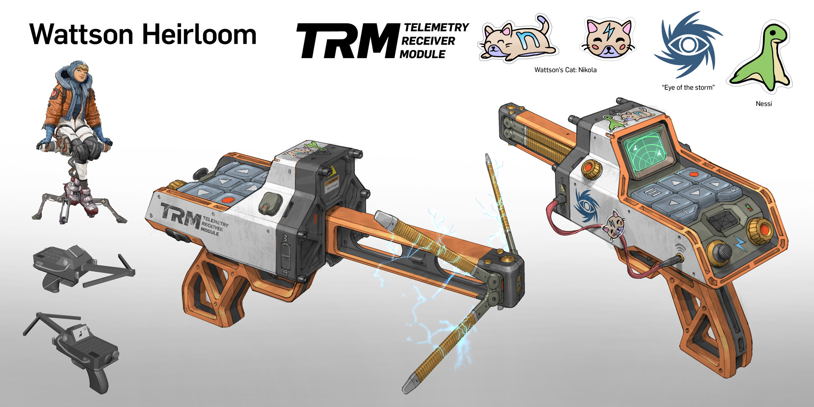

# Wattson Heirloom

Wattson is a character from the video game [Apex Legends](https://www.ea.com/games/apex-legends). This is a project to build a 3D-printed version of her "Telemetry Receiver Module" [Heirloom](https://apexlegends.fandom.com/wiki/Heirloom), with functioning electronics (not a real radar, thought).

## Site Index

- [3D Models](./models)
- [Schematics](./schema)
- [Media](./media)
- [Parts Info](./parts)
- [Arduino Source Code](https://github.com/zbauman3/wattson-heirloom)