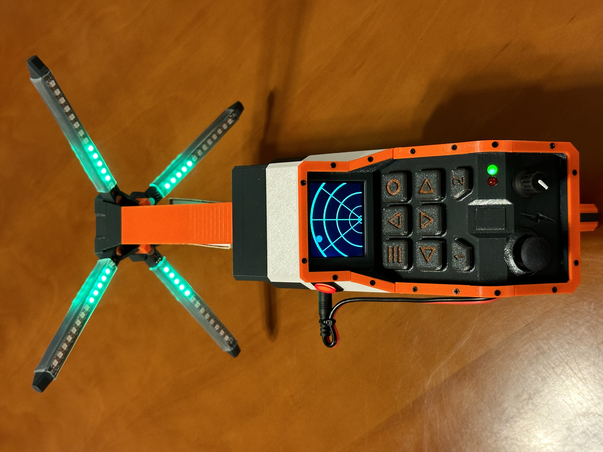

# Media

- [Media](#media)
  - [Assembled](#assembled)
  - [Assembly](#assembly)
  - [Screens](#screens)
  - [Stickers](#stickers)
  - [Schematics](#schematics)

## Assembled

<video controls="controls" class="img-full" name="">
  <source src="./assets/media/videos/Radar Screen.MOV">
</video>
<video controls="controls" class="img-full" name="">
  <source src="./assets/media/videos/Rainbow Lights.MOV">
</video>
<video controls="controls" class="img-full" name="">
  <source src="./assets/media/videos/Trigger.MOV">
</video>

## Assembly

<video controls="controls" class="img-full" name="Light Rods Assembly">
  <source src="./assets/media/assembly/light-rods.mov">
</video>

## Screens

 Mode.jpeg" class="img-full" />
 Brightness.jpeg" class="img-full" />
 Speed.jpeg" class="img-full" />
 Direction.jpeg" class="img-full" />

 Theme Color.jpeg" class="img-full" />
 Overrid Plug.jpeg" class="img-full" />
 Override Trigger.jpeg" class="img-full" />
 Reset.jpeg" class="img-full" />

## Stickers

## Schematics

