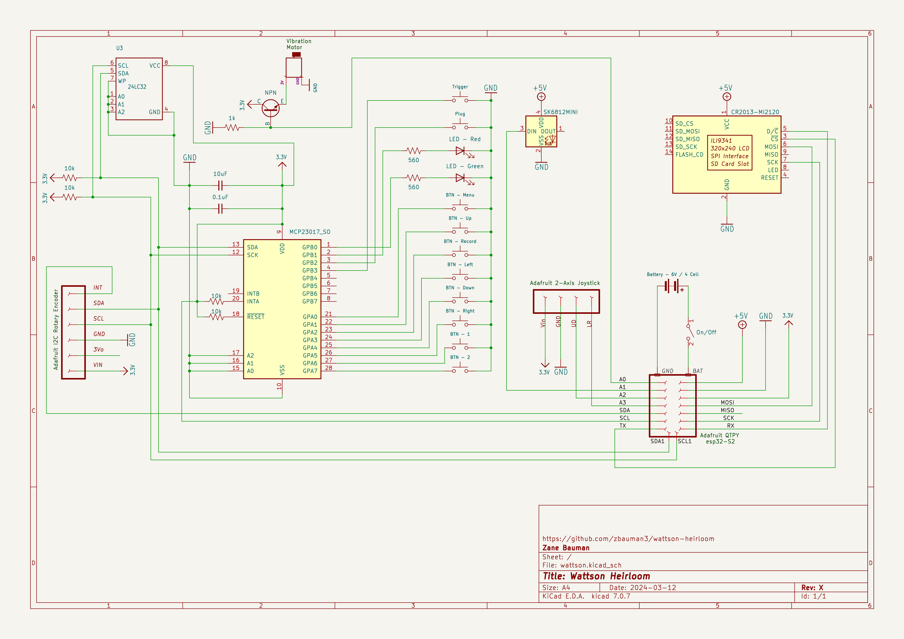

# Schematics

The schematics were built with KiCad. I only used the schematics functionality, but I'll link the entire project here.

- [wattson.kicad_pro](./assets/KiCad/wattson.kicad_pro)
- [wattson.kicad_sch](./assets/KiCad/wattson.kicad_sch)
- [wattson.kicad_pcb](./assets/KiCad/wattson.kicad_pcb) (unused)
- [wattson.kicad_prl](./assets/KiCad/wattson.kicad_prl) (unused)

